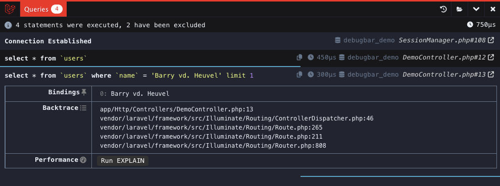
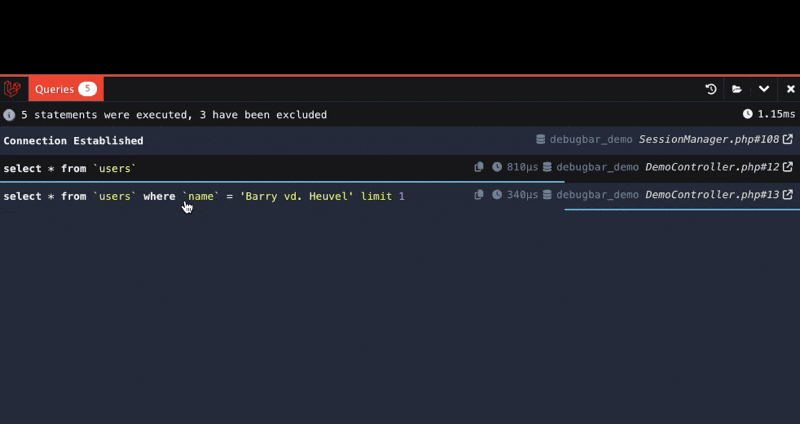
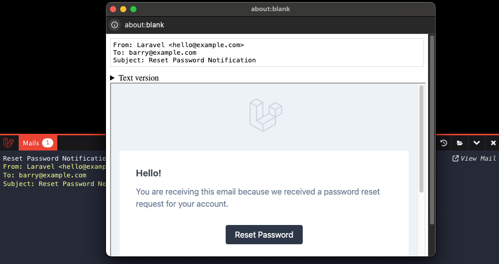

---
hide:
  - navigation
---
!!! warning

    Debugbar can slow the application down (because it has to gather and render data). So when experiencing slowness, try disabling some of the collectors.

# Collectors

This package includes with these Collectors enabled by default:

- [Queries](#db): Show all database queries
- [Messages](#messages): Debug messages and objects
- [Logs](#log): Show all Log messages (Show in Messages when available)
- [Views](#views): Show the currently loaded views.
- [Timeline](#time): Timeline with Booting and Application timing
- [Route](#route): Show information about the current Route.
- [Exceptions](#exceptions): Exceptions and Throwable with stacktrace
- [Session](#session): Current session data
- [Request](#request): Request data
- [Livewire](#livewire): Only active when Livewire is used
- [PhpInfo](#phpinfo): Current PHP version


These collectors can be enabled in the config:

- [Gate](#gate): Show the gates that are checked
- [Events](#events): Show all events
- [Auth](#auth): Logged in status
- [Mail](#mail): Sent emails
- [Laravel Info](#laravel): Show the Laravel version and Environment. 
- [Memory](#memory): Memory usage
- [Config](#config): Display the values from the config files.
- [Cache](#cache): Display all cache events. 
- [Models](#models): Loaded Models
- [Jobs](#jobs): Sent emails
- [Pennant](#pennant): Show Pennant flags
- [Files](#files): Show the files that are included/required by PHP.

To enable or disable any of the collectors, set the configuration to `true` or `false`. Some collector have additional options in the configuration:

<details><summary>config/debugbar.php</summary>

```php

   /*
     |--------------------------------------------------------------------------
     | DataCollectors
     |--------------------------------------------------------------------------
     |
     | Enable/disable DataCollectors
     |
     */

    'collectors' => [
        'phpinfo'         => true,  // Php version
        'messages'        => true,  // Messages
        'time'            => true,  // Time Datalogger
        'memory'          => true,  // Memory usage
        'exceptions'      => true,  // Exception displayer
        'log'             => true,  // Logs from Monolog (merged in messages if enabled)
        'db'              => true,  // Show database (PDO) queries and bindings
        'views'           => true,  // Views with their data
        'route'           => true,  // Current route information
        'auth'            => false, // Display Laravel authentication status
        'gate'            => false,  // Display Laravel Gate checks
        'session'         => true,  // Display session data
        'symfony_request' => true,  // Only one can be enabled..
        'mail'            => false,  // Catch mail messages
        'laravel'         => false, // Laravel version and environment
        'events'          => false, // All events fired
        'default_request' => false, // Regular or special Symfony request logger
        'logs'            => false, // Add the latest log messages
        'files'           => false, // Show the included files
        'config'          => false, // Display config settings
        'cache'           => false, // Display cache events
        'models'          => false,  // Display models
        'livewire'        => true,  // Display Livewire (when available)
        'jobs'            => false, // Display dispatched jobs
        'pennant'         => false, // Display Pennant feature flags
    ],

    


```

</details>

## Query Collector { #db }

<!-- md:version v1.0 -->
<!-- md:feature collectors.db -->

The Query Collector has the following features
 - Show the executed queries including timing
 - Show/mark duplicate queries
 - Show used parameters
 - Run on-demand 'EXPLAIN' queries and link to Visual Explain  (disabled bu default)
 - Copy the query to clipboard
 - Show the source of the query and open in editor
 - Visualize the duration of the queries with bottom border
 - Add queries to the timeline (disabled by default)
 - Limit the number of queries to avoid slowing down the Debugbar.
 - Exclude paths (eg. for session or vendors)
 - Show memory usage (disabled by default)



<details><summary>config/debugbar.php</summary>

```php
  'options' => [
        // ...
        'db' => [
            'with_params'       => true,   // Render SQL with the parameters substituted
            'exclude_paths'     => [       // Paths to exclude entirely from the collector
                // 'vendor/laravel/framework/src/Illuminate/Session', // Exclude sessions queries
            ],
            'backtrace'         => true,   // Use a backtrace to find the origin of the query in your files.
            'backtrace_exclude_paths' => [],   // Paths to exclude from backtrace. (in addition to defaults)
            'timeline'          => false,  // Add the queries to the timeline
            'duration_background'  => true,   // Show shaded background on each query relative to how long it took to execute.
            'explain' => [                 // Show EXPLAIN output on queries
                'enabled' => false,
            ],
            'hints'             => false,   // Show hints for common mistakes
            'show_copy'         => true,    // Show copy button next to the query,
            'slow_threshold'    => false,   // Only track queries that last longer than this time in ms
            'memory_usage'      => false,   // Show queries memory usage
            'soft_limit'       => 100,      // After the soft limit, no parameters/backtrace are captured
            'hard_limit'       => 500,      // After the hard limit, queries are ignored
        ],
        // ...
    ],
```
</details>

### On-demand query EXPLAIN

<!-- md:version v3.14.0 -->
<!-- md:flag experimental -->
<!-- md:feature options.db.explain -->

Enable the `options.db.explain` option to run on-demand EXPLAIN queries for any SELECT query in the Debugbar.
This will update in the interface. You also have an option to navigate to mysqlexplain.com for a visual explain.




### Query limits

<!-- md:version v3.10.0 -->
<!-- md:feature options.db.soft_limit: 100 -->
<!-- md:feature options.db.hard_limit: 500 -->

With Query Hard & Soft limits, you can reduce the amount of queries shown by default. When the soft limit is reached, bindings will be excluded.
When the hard limit is reached, the queries are excluded altogether to prevent loading too much data.
If you want to avoid any limits, you can set the option to `null`


## Messages Collector { #messages }

<!-- md:version v1.0 -->
<!-- md:feature collectors.messages -->

The Message collectors gathers all messages from `debug()` calls and anything written to the logs.

You can pass multiple parameters to `debug()`, even complex object.

### Trace

When calling `debug()`, the source of the call is shown and can be opened with your IDE.

<!-- md:version v3.10.0 -->
<!-- md:feature options.messages.trace -->


## Log Collectors { #log }

<!-- md:version v1.0 -->
<!-- md:feature collectors.log -->

When the [Messages Collector](#messages) is enabled, Log messages are added to the Messages tab. Otherwise a Monolog tab will show with just the log messages


## Views { #views }

<!-- md:version v1.0 -->
<!-- md:feature collectors.views -->

The ViewCollector shows views and has the following features:

- Show used templates and source
- Optionally add them to the timeline
- Group similar views (useful for components)
- Exclude folders (eg. for Filament or other vendors)
- Optionally show data (this can be resource heavy)


```php
    'options' => [
        'views' => [
            'timeline' => false,    // Add the views to the timeline (Experimental)
            'data' => false,        //true for all data, 'keys' for only names, false for no parameters.
            'group' => 50,          // Group duplicate views. Pass value to auto-group, or true/false to force
            'exclude_paths' => [    // Add the paths which you don't want to appear in the views
                'vendor/filament'   // Exclude Filament components by default
            ],
        ],
    ]

```

## Timeline { #time }

<!-- md:version v1.0 -->
<!-- md:feature collectors.time -->


<details><summary>config/debugbar.php</summary>

```php
    'options' => [
        'time' => [
            'memory_usage' => false,  // Calculated by subtracting memory start and end, it may be inaccurate
        ],
    ]
```

</details>

## Route { #route }

<!-- md:version v1.0 -->
<!-- md:feature collectors.route -->

This shows the current route and middleware.


## Exceptions { #exceptions }

<!-- md:version v1.0 -->
<!-- md:feature collectors.exceptions -->

Show any errors from the application, including traces.

You can manually add exceptions by calling `debugbar()->addThrowable($throwable);`


## Session { #session }

<!-- md:version v1.0 -->
<!-- md:feature collectors.phpinfo -->
<!-- md:default false -->

A simple widget showing the current PHP Version.


## Request { #request }

<!-- md:version v1.0 -->
<!-- md:feature collectors.request -->

Show Request info, like headers, data, cookies etc. Sensitive data is hidden by default, but you can add your own sensitive data to the config.


<details><summary>config/debugbar.php</summary>

```php
    'options' => [
        'symfony_request' => [
            'hiddens' => [], // hides sensitive values using array paths, example: request_request.password
        ],
    ],
```

</details>

## Livewire { #livewire }

<!-- md:version v3.3.3 -->
<!-- md:feature collectors.livewire -->

Show the Livewire components that are rendered on the page.


## PHP Info { #phpinfo }

<!-- md:version v1.0 -->
<!-- md:feature collectors.phpinfo -->

A simple widget showing the current PHP Version.


## Gate { #gate }

<!-- md:version v2.1.0 -->
<!-- md:feature collectors.gate -->
<!-- md:default false -->

The Gate Collector shows the checks that have passed or failed.


## Events { #events }

<!-- md:version v1.0 -->
<!-- md:feature collectors.events -->

This is similar to the Timeline buts adds all events. This can be a lot of data, so use with caution.


## Auth { #auth }

<!-- md:version v1.2.2 -->
<!-- md:feature collectors.auth -->
<!-- md:default false -->

A widget showing the current login status + a collector with more information.


<details><summary>config/debugbar.php</summary>

```php
    'options' => [
        'auth' => [
            'show_name' => true,   // Also show the users name/email in the debugbar
            'show_guards' => true, // Show the guards that are used
        ],
    ],
```

</details>

## Mail { #mail }

<!-- md:version v1.0 -->
<!-- md:feature collectors.mail -->
<!-- md:default false -->

A collector showing the sent emails.


### Mail Preview

<!-- md:version v3.12.0 -->
<!-- md:feature options.mail.show_body -->
<!-- md:default true -->

You can open a rendered preview of the email when the body is attached, by clicking 'View Mail'



## Laravel Info { #laravel }

<!-- md:version v1.0 -->
<!-- md:feature collectors.laravel -->
<!-- md:default false -->

A widget showing the current Laravel Version, environment and locale.


## Memory Usage { #memory }

<!-- md:version v1.0 -->
<!-- md:feature collectors.memory -->
<!-- md:default false -->

Show the Memory Usage of the application

<details><summary>config/debugbar.php</summary>

```php
    'options' => [
        'memory' => [
            'reset_peak' => false,     // run memory_reset_peak_usage before collecting
            'with_baseline' => false,  // Set boot memory usage as memory peak baseline
            'precision' => 0,          // Memory rounding precision
        ],
    ]
```

</details>


## Config { #config }

<!-- md:version v3.0 -->
<!-- md:feature collectors.config -->
<!-- md:default false -->

!!! warning

     Be careful when turning this on, as it can expose sensitive credentials. Make sure your app is not publicly available.


Shows the loaded configuration values.


## Cache { #cache }

<!-- md:version v3.0.0 -->
<!-- md:feature collectors.cache -->
<!-- md:default false -->

Show the hits/misses of the Cache in a Timeline.


<details><summary>config/debugbar.php</summary>

```php
    'options' => [
        'values' => true, // collect cache values
    ],
```

</details>

## Models { #models }

<!-- md:version v3.2.5-->
<!-- md:feature collectors.models -->
<!-- md:default false -->

Shows how often each Model is loaded. If this is high, you might want move some logic to SQL instead of processing large Collections.


## Jobs { #jobs }

<!-- md:version v3.2.5-->
<!-- md:feature collectors.models -->
<!-- md:default false -->

Show the Jobs that are dispatched from this request.


## Pennant { #pennant }

<!-- md:version v3.14.0 -->
<!-- md:feature collectors.pennant -->
<!-- md:default false -->

Shows all the Pennant flags that are checked during this request


## Files { #files }

<!-- md:version v1.0 -->
<!-- md:feature collectors.files -->
<!-- md:default false -->

!!! deprecated

     This was mainly useful before OPcache was widely used, and this collector could be used for optimizing files. It's deprecated now.


## Additional options

<details><summary>config/debugbar.php</summary>

```php
/*
     |--------------------------------------------------------------------------
     | Extra options
     |--------------------------------------------------------------------------
     |
     | Configure some DataCollectors
     |
     */

    'options' => [
        'time' => [
            // See above
        ],
        'messages' => [
            'trace' => true,   // Trace the origin of the debug message
        ],
        'memory' => [
            'reset_peak' => false,     // run memory_reset_peak_usage before collecting
            'with_baseline' => false,  // Set boot memory usage as memory peak baseline
            'precision' => 0,          // Memory rounding precision
        ],
        'auth' => [
            'show_name' => true,   // Also show the users name/email in the debugbar
            'show_guards' => true, // Show the guards that are used
        ],
        'db' => [
            // See above        
        ],
        'mail' => [
            'timeline' => false,  // Add mails to the timeline
            'show_body' => true,
        ],
        'views' => [
            // See above
        ],
        'route' => [
            'label' => true,  // show complete route on bar
        ],
        'session' => [
            'hiddens' => [], // hides sensitive values using array paths
        ],
        'symfony_request' => [
            'hiddens' => [], // hides sensitive values using array paths, example: request_request.password
        ],
        'events' => [
            'data' => false, // collect events data, listeners
        ],
        'logs' => [
            'file' => null,
        ],
        'cache' => [
            'values' => true, // collect cache values
        ],
    ],

```

</details>